# SQ3B

## Vorarbeiten

In der SideQuest 3A wurde bereits eine Java Applikation erstell, um eine Sinuskurve für unser Grafana zu erstellen und anzeigen zu lassen.

Als Dependency wurde eclipse.paho.client.mqttv3 verwrendet. (Siehe Bild)
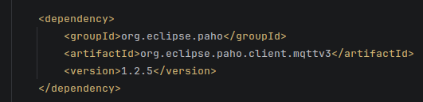

Zusätzlich haben wir einen Stop befehl hinzugefügt, welcher vom Terminal aus gesendet werden kann.

Im folgenden Bild sehen Sie die erstellte Java Applikation
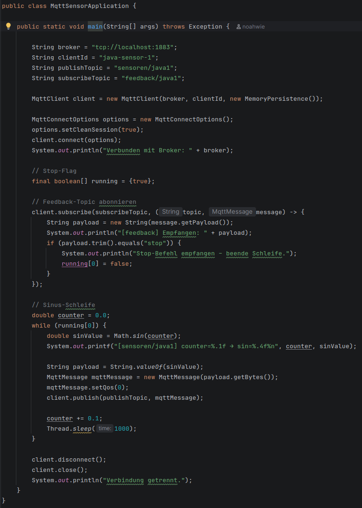

## Anforderung
- **Erweiterung des Java-Sensorprogramms**
Das bestehende Java-Programm, welches Sensordaten an einen MQTT-Broker sendet, soll erweitert werden.
- **Übergabe von Topics über Parameter**
Die PUB- und SUB-Topics müssen beim Start des Programms über Kommandozeilenparameter übergeben werden können.
- **Alternative Übergabe über Umgebungsvariablen**
Falls keine Parameter angegeben werden, sollen die Topics auch über Umgebungsvariablen gesetzt werden können.
- **Simulation mehrerer Sensoren**
Es muss möglich sein, mehrere Sensor-Instanzen gleichzeitig zu starten, wobei jede Instanz unterschiedliche PUB-Topics verwenden kann.
- **Test der Funktionalität**
Die Sensoren werden in mehreren Terminals mit zeitlichem Abstand gestartet, um zu prüfen, ob die Daten korrekt an den MQTT-Broker gesendet werden.
- **Visualisierung der Daten**
Die gesendeten Sensordaten werden anschließend in Grafana visualisiert, um das Monitoring der Sensorwerte zu ermöglichen.
- **Nachweis der Funktion**
Die korrekte Funktion wird durch Screenshots der Grafana-Konfiguration und der angezeigten Sensordaten dokumentiert.


## Ausführung
### Die Erstellung der Jar-File  
Hinzufügen der Dependency
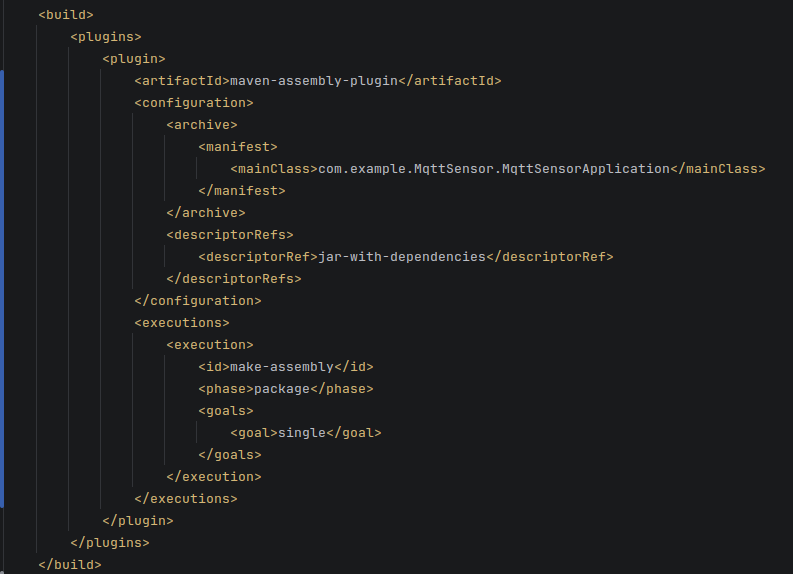

### Die Erweiterung des Java Programmes.
```Java
java klasse:
 
public class MqttSensorApplication {
 
	public static void main(String[] args) throws Exception {
 
		// Standardwerte
		String publishTopic = "sensoren/java1";
		String subscribeTopic = "feedback/java1";
 
		// Kommandozeilen-Parameter auslesen (--pub=X, --sub=X)
		for (String arg : args) {
			if (arg.startsWith("--pub=")) {
				publishTopic = "sensoren/java" + arg.substring(6);
			} else if (arg.startsWith("--sub=")) {
				subscribeTopic = "feedback/java" + arg.substring(6);
			}
		}
 
		// Umgebungsvariable MQTT_BROKER (Fallback: localhost)
		String brokerHost = System.getenv("MQTT_BROKER");
		if (brokerHost == null || brokerHost.isEmpty()) {
			brokerHost = "localhost";
		}
		String broker = "tcp://" + brokerHost + ":1883";
 
		System.out.println("Broker:    " + broker);
		System.out.println("PUB Topic: " + publishTopic);
		System.out.println("SUB Topic: " + subscribeTopic);
 
		String clientId = "java-sensor-" + publishTopic.replace("/", "-");
		MqttClient client = new MqttClient(broker, clientId, new MemoryPersistence());
 
		MqttConnectOptions options = new MqttConnectOptions();
		options.setCleanSession(true);
		client.connect(options);
		System.out.println("Verbunden mit Broker: " + broker);
 
		final boolean[] running = {true};
		final String finalSubscribeTopic = subscribeTopic;
 
		// Feedback-Topic abonnieren
		client.subscribe(subscribeTopic, (topic, message) -> {
			String payload = new String(message.getPayload());
			System.out.println("[" + finalSubscribeTopic + "] Empfangen: " + payload);
			if (payload.trim().equals("stop")) {
				System.out.println("Stop-Befehl empfangen – beende Schleife.");
				running[0] = false;
			}
		});
 
		// Sinus-Schleife
		double counter = 0.0;
		final String finalPublishTopic = publishTopic;
		while (running[0]) {
			double sinValue = Math.sin(counter);
			System.out.printf("[%s] counter=%.1f → sin=%.4f%n", finalPublishTopic, counter, sinValue);
 
			MqttMessage mqttMessage = new MqttMessage(String.valueOf(sinValue).getBytes());
			mqttMessage.setQos(0);
			client.publish(finalPublishTopic, mqttMessage);
 
			counter += 0.1;
			Thread.sleep(1000);
		}
 
		client.disconnect();
		client.close();
		System.out.println("Verbindung getrennt.");
	}
}
```

### Erstellung des Package (JAR)
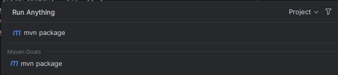

### Starten der Sensoren  
Im Ordner des Programmes den Befehl ausführen:

PARAMS:  
--pub=* (* nummer des Topics )   
--sub=* (* nummer des Topics)

Befehl:  
```bash 
ava -jar target/MqttSensor-0.0.1-SNAPSHOT-jar-with-dependencies.jar --pub=3 --sub=3
```
Befehl ausgeführt in drei verschiedenen Konsolen
- Konsole 1  
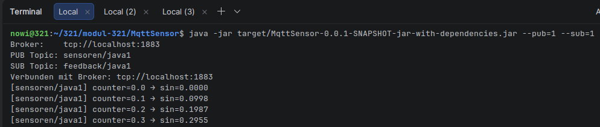

- Konsole 2
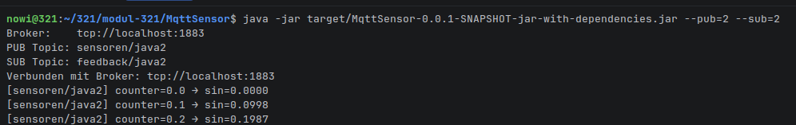

- Konsole 3 
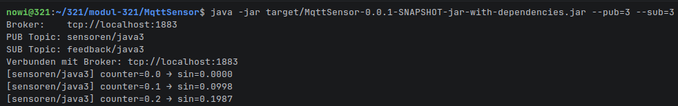

### Stoppen 
Aus einer weiteren Konsole können alle 3 erstellten Programme gestoppt werden.

Params:
- "feedback/java*" (* durch den ausgefürten startbefehl ersetzen)

```bash
mosquitto_pub -t "feedback/java3" -m "stop"
```

Übersicht
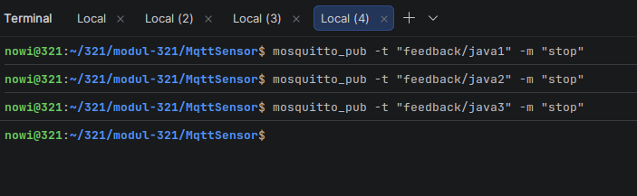

- Stop 1
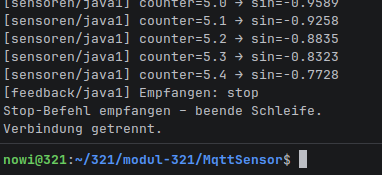

- Stop 2
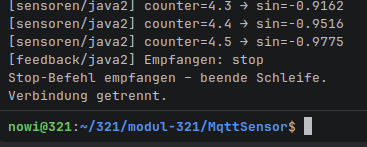

- Stop 3
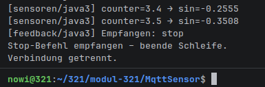


## Ergebnis

Im folgenden Bilde sehen Sie das Ergebnis dargestellt in Grafana.  
Die Dashboard Konfiguration wurde von SQ2C übernommen und es wurde zu den neu erstellten Subscriber-Topics ein Listener (Data-Source) hinzugefügt.
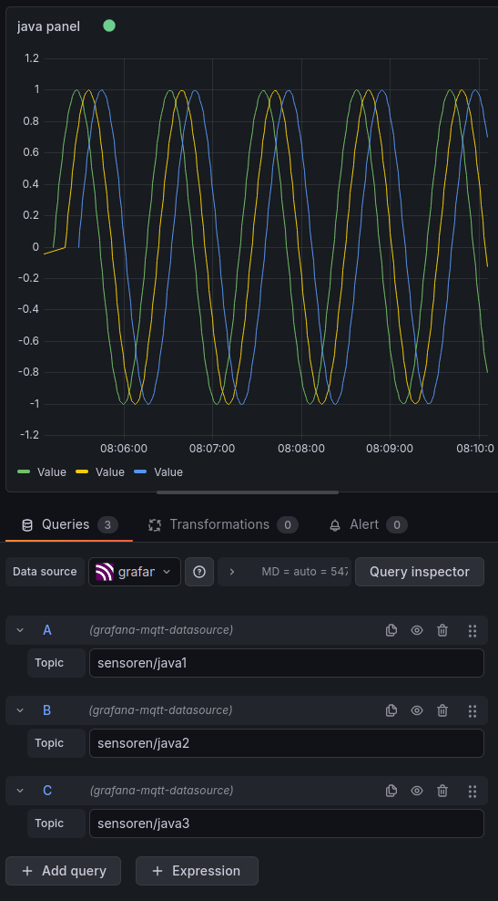