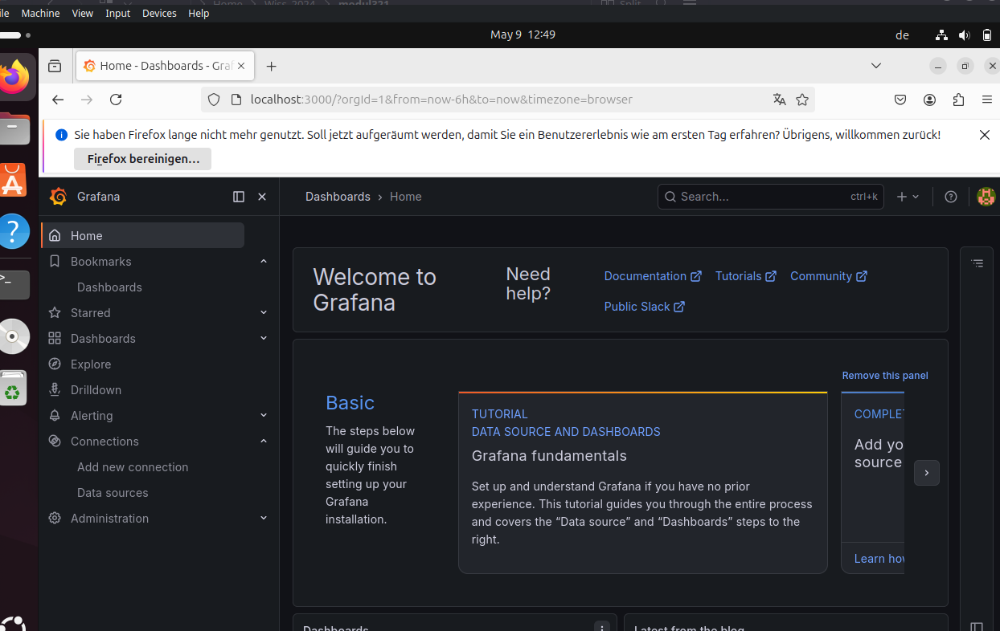
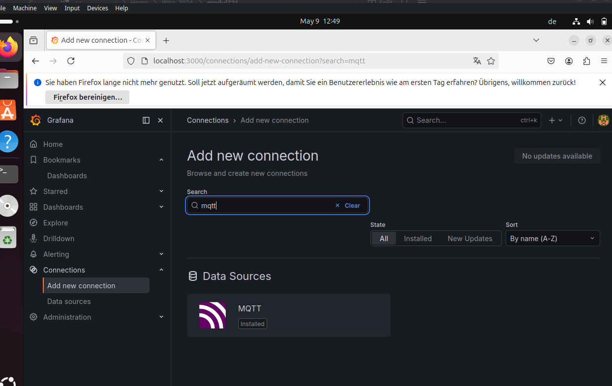
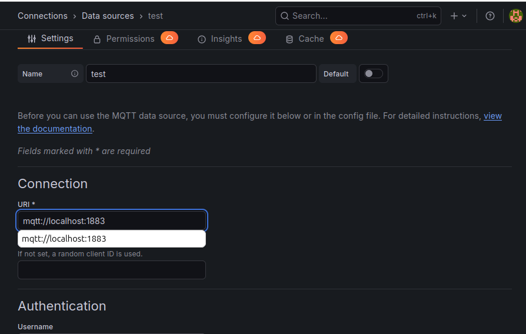
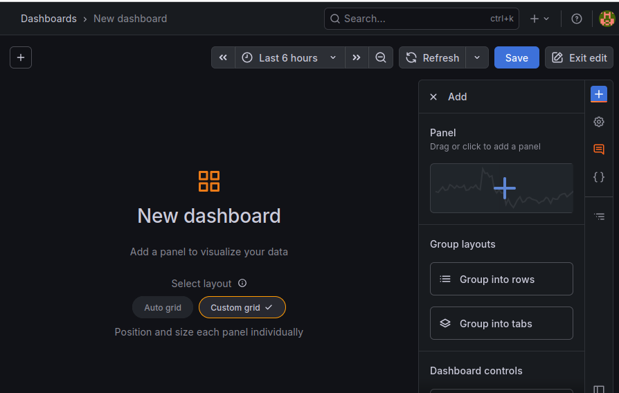
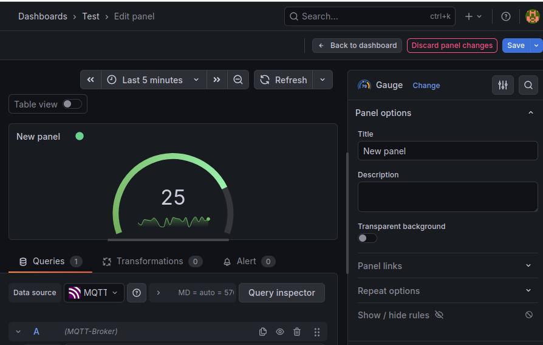
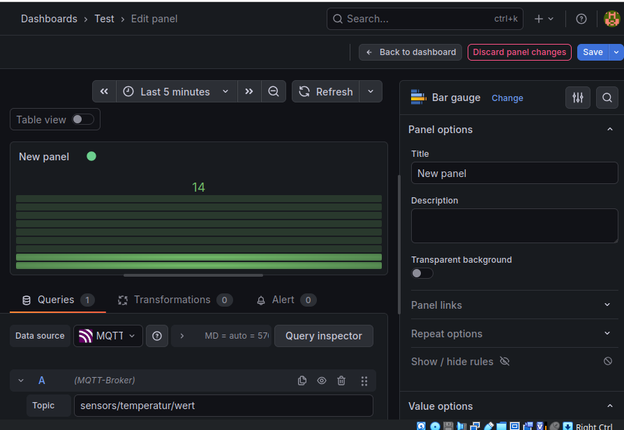

# Modul 321 Remo Noah
## Intro
Nach den Sidequests 2A und 2B läuft auf einer Ubuntu VM ein Mosquitto Broker. Auf diesem Broker wurde ein Topic test. Via zwei Terminals, eines als Publisher das ander als Subcriber, wurde eine Message "Hello World" auf das Topic geschickt um die Basics zu verstehen.
In der Aufgabe 2B wurde das lokale MQTT-System erweitert mit mehreren Dummy Sensoren. Jeder dieser Sensoren hat einen Namen und ein zugeordnetes Topic. Jeder Sensor sendet fortlaufend1 im Sekundentakt eine Zufallszahl2 für sein topic an den MQTT-Broker.

## Sidequest 2C
### Aufgabe
In einem ersten schritt wurde Grafana auf die VM installiert.
#### Installations anleitung Grafana
``` bash
sudo apt-get install grafana-enterprise
sudo apt-get install grafana
sudo apt-get update
echo "deb [signed-by=/etc/apt/keyrings/grafana.asc] https://apt.grafana.com beta main" | sudo tee -a /etc/apt/sources.list.d/grafana.list
echo "deb [signed-by=/etc/apt/keyrings/grafana.asc] https://apt.grafana.com stable main" | sudo tee -a /etc/apt/sources.list.d/grafana.list
sudo mkdir -p /etc/apt/keyringssudo wget -O /etc/apt/keyrings/grafana.asc https://apt.grafana.com/gpg-full.keysudo chmod 644 /etc/apt/keyrings/grafana.asc
sudo apt-get install -y apt-transport-https wget gnupg
```
Anschliessend wurde das Grafana-MQTT Plugin auf die VM installiert.
#### Installations anleitung Grafana
1. Das MQTT-Plugin in Grafana aktivieren
Falls noch nicht geschehen, stelle sicher, dass das Plugin installiert und Grafana neu gestartet wurde:
Bash
 
``` bash
sudo grafana-cli plugins install grafana-mqtt-datasource
sudo systemctl restart grafana-server
```
### Dashboard einrichten Anleitung
2. MQTT-Datasource konfigurieren
Öffne http://localhost:3000 in deinem Browser.

Logge dich ein (admin / admin).
Gehe zu Connections -> Data Sources -> Add data source.
Suche nach MQTT und wähle es aus.

Einstellungen:
Name: MQTT-Broker
URL: mqtt://localhost:1883 (Da Mosquitto den Port auf deiner VM bereitstellt).

Klicke unten auf Save & Test. Es sollte eine grüne Erfolgsmeldung erscheinen.
3. Dashboard und Panel für deine Sensoren erstellen
Jetzt visualisieren wir deine Zufallszahlen:
Klicke links oben auf das "+" (Create) -> Dashboard.

Klicke auf Add visualization.
Wähle deine gerade erstellte MQTT-Broker Datenquelle aus.
Im Query-Editor (unten):
Topic: Gib das Topic eines deiner Sensoren ein, z.B. sensors/temperatur/wert.
Rechts im Panel-Editor:
Wähle als Typ "Time series" (für einen Verlauf) oder "Gauge" (für eine Tacho-Anzeige).

