# Deployment and Installation of Prometheus

1. Create the Folder
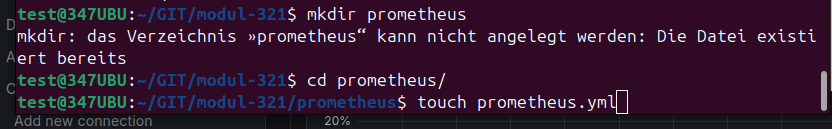
2. Create the File
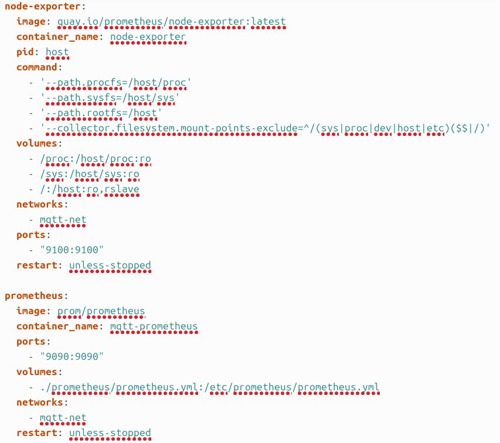
3. Prometheus settings
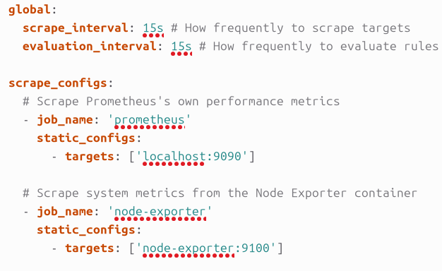
4. Start the container
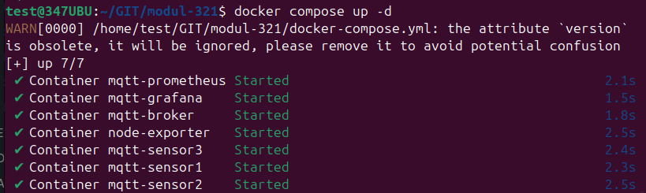
5. Go to Prometheus site `localhost:9000`
6. Add the expression up and Execute
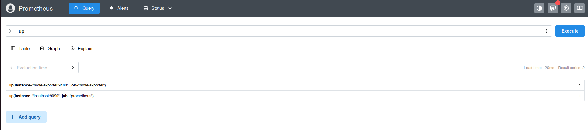
7. Check the Status
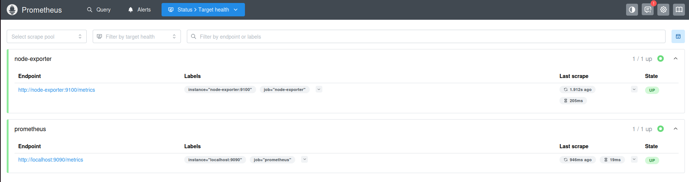
8. Add Prometheus to Grafana
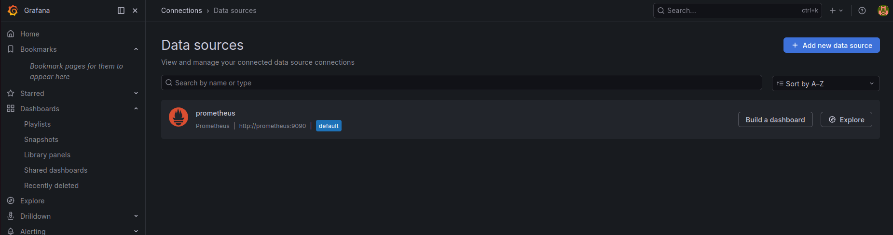
9. Adapt the Settings
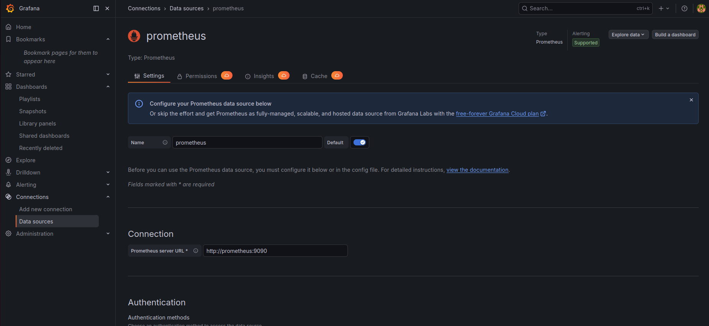
10. Test the Setting
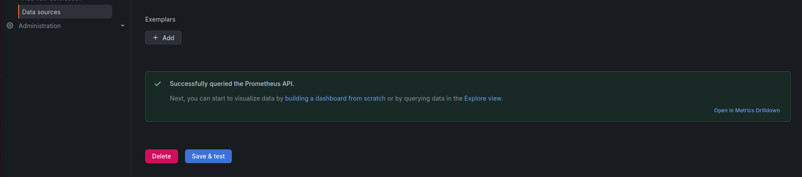
11. Import the Dashboard from Node Express
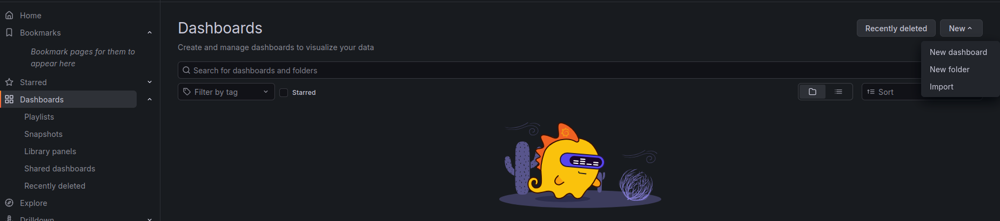
12. The Import Code is 1860 for the Dashboard
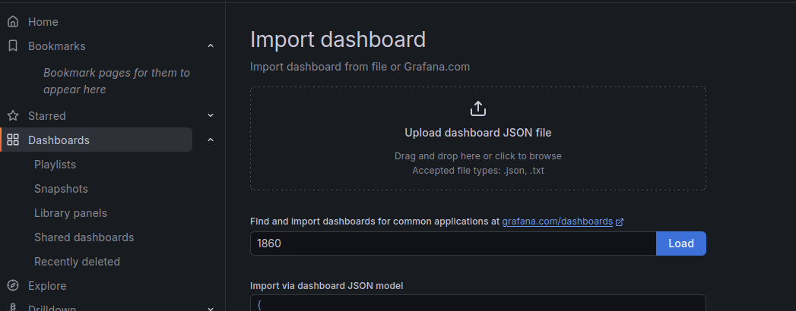

**Final Dashboard**
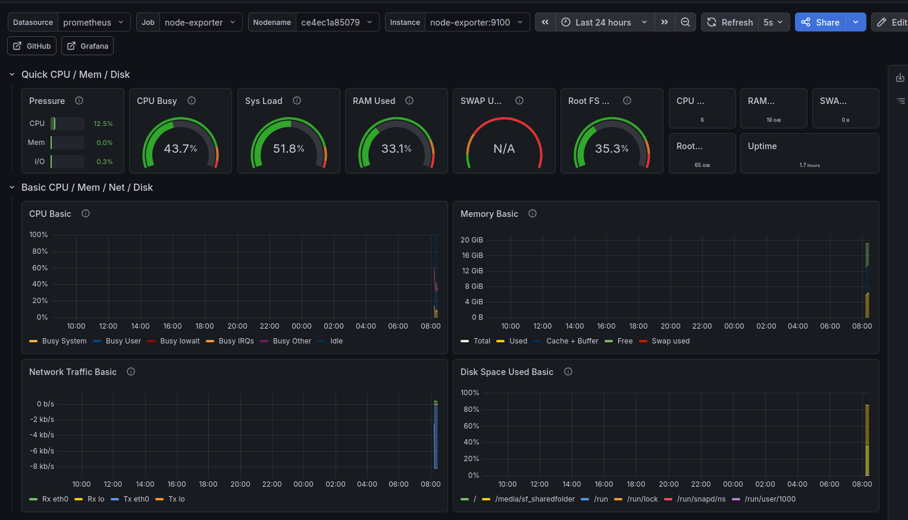

