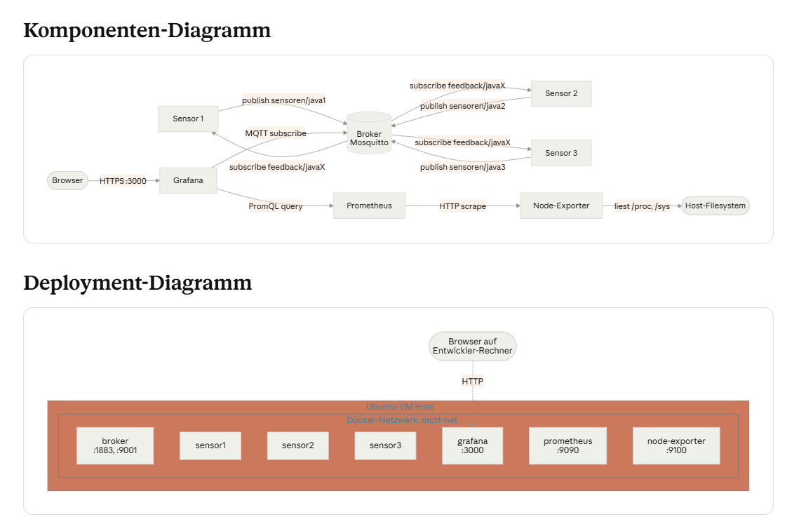
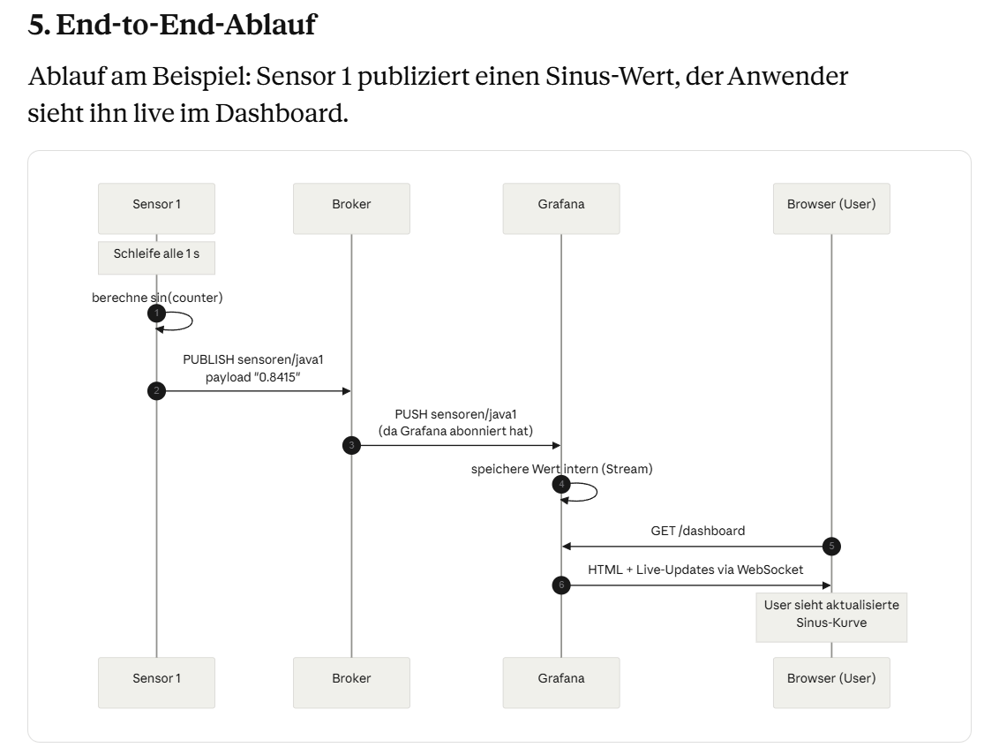

Dokumentation des verteilten Systems
1. Einleitung
Im Verlauf des Moduls wurde ein verteiltes System aufgebaut, das mehrere Sensoren über einen Message-Broker an ein zentrales Dashboard anbindet und parallel den darunterliegenden Host überwacht. Alle Komponenten laufen containerisiert in einem gemeinsamen Docker-Compose-Stack.

2. Systeme und Dienste
Komponente	Technologie	Aufgabe
Broker	Eclipse Mosquitto 2	Zentraler MQTT-Broker, verteilt Nachrichten nach Topic
Sensor 1–3	Java 21 + Eclipse Paho	Publizieren Sinus-Werte, abonnieren Feedback-Topic
Grafana	Grafana + MQTT-Plugin	Dashboard für Sensor-Live-Daten und Host-Metriken
Prometheus	Prometheus	Metrik-Datenbank, scrapt Node-Exporter
Node-Exporter	Prometheus Node-Exporter	Liest Host-Metriken (CPU, Memory, Disk) aus
Host	Ubuntu 24.04 (VM)	Laufzeitumgebung für alle Container
Plattform: Docker mit Docker Compose. Alle Container liegen im gemeinsamen Netzwerk mqtt-net und finden sich über ihre Service-Namen.

3. Architektur
Das System trennt klar in zwei Datenflüsse:

Anwendungsdaten (Sensor-Werte) fliessen über MQTT
Infrastruktur-Metriken (Host-Status) fliessen über das Prometheus-Scrape-Modell
Beides läuft in Grafana zusammen, das als zentrale Visualisierungsschicht dient.

Nur drei Ports sind nach aussen exponiert: 1883 (MQTT, falls externe Clients anbinden), 3000 (Grafana-UI), 9090 (Prometheus-UI für Debugging). Die Sensoren publishen nur intern und brauchen keine Host-Ports.

4. Interaktionen
Nr.	Quelle	Ziel	Protokoll	Inhalt
1	Sensor 1–3	Broker	MQTT publish	sensoren/javaX → Sinus-Wert
2	Broker	Sensor 1–3	MQTT push	feedback/javaX → Stop-Befehle
3	Grafana	Broker	MQTT subscribe	sensoren/javaX Live-Stream
4	Prometheus	Node-Exporter	HTTP GET /metrics	Host-Metriken, alle 15 s
5	Grafana	Prometheus	HTTP (PromQL)	Anfrage auf gescrapte Metriken
6	Browser	Grafana	HTTP	Dashboard-Aufruf
Entkopplung über MQTT: Sensoren und Grafana kennen einander nicht direkt – nur das Topic. Komponenten lassen sich austauschen oder ergänzen, ohne andere anzupassen.

Pull statt Push bei Metriken: Prometheus zieht aktiv vom Node-Exporter (Pull-Modell). Vorteil: Prometheus kennt den Status jedes Targets (via Health Check), und Targets brauchen keine Kenntnis von Prometheus.

5. End-to-End-Ablauf
Ablauf am Beispiel: Sensor 1 publiziert einen Sinus-Wert, der Anwender sieht ihn live im Dashboard.

Schritt für Schritt:

Sensor 1 berechnet im Sekundentakt sin(counter) und erhöht den Zähler.
Der Wert wird als MQTT-Nachricht auf das Topic sensoren/java1 publiziert (Verbindung zum Broker via Service-Name broker:1883).
Der Broker leitet die Nachricht an alle Subscriber des Topics weiter – in diesem Fall Grafana.
Grafana hält den Wert im Live-Stream-Puffer.
Der Anwender öffnet im Browser das Dashboard auf http://<vm>:3000.
Grafana liefert das Panel und pusht neue Werte via WebSocket nach.
Gegenrichtung (Stop-Befehl): Wird auf feedback/java1 der Text stop publiziert, empfängt Sensor 1 die Nachricht über sein Subscribe-Callback und beendet die Publish-Schleife. Die anderen Sensoren laufen weiter – saubere Entkopplung pro Sensor durch eigenes Feedback-Topic.

6. Fazit
Das System demonstriert die Kernprinzipien verteilter Systeme:

Entkopplung der Komponenten über den Broker (Publish/Subscribe)
Service-Discovery über Service-Namen im Compose-Netzwerk
Beobachtbarkeit durch separate Metrik-Schicht (Prometheus + Node-Exporter + Grafana)
Portabilität durch vollständige Containerisierung – der Stack ist mit einem Befehl auf jedem Docker-fähigen Host reproduzierbar
In einer produktiven Umgebung würden zusätzlich Authentifizierung (MQTT-User/Password, Grafana-SSO), TLS, Persistenz für Broker-Sessions und ein redundanter Broker dazukommen.
